# Roblox Kick Animation - 3D Voxel Animation


A 3D voxel-based animation system featuring a Roblox-style character performing a soccer kick animation with multi-camera perspectives and realistic ball physics.

## Showcase

### Character Orbit Animation
<p align="center">
  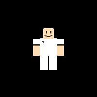
  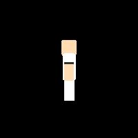
  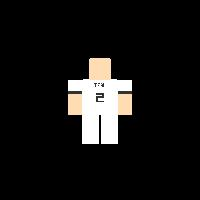
  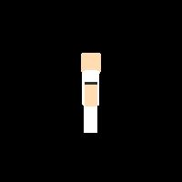
</p>

### Kick Animation - Front Camera
<p align="center">
  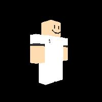
  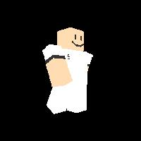
  
  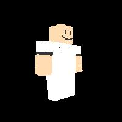
</p>

### Kick Animation - Back Camera
<p align="center">
  
  
  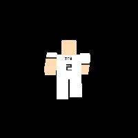
  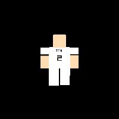
</p>

### Soccer Ball Orbit
<p align="center">
  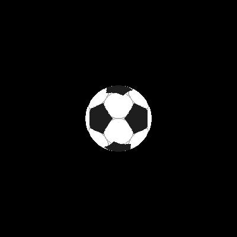
  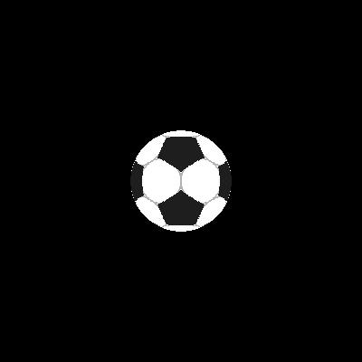
  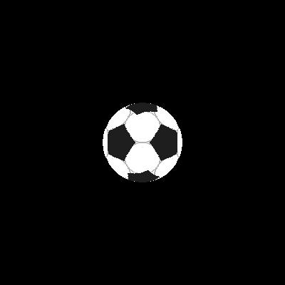
  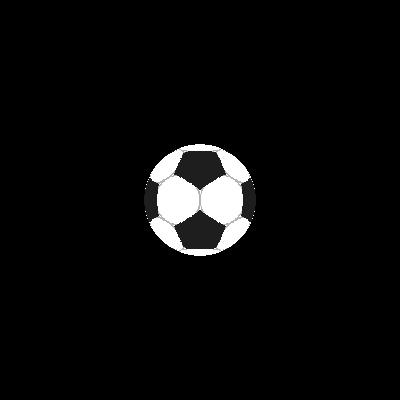
</p>

## Overview

This project demonstrates advanced 3D graphics concepts using pure Python, NumPy, and Matplotlib. It creates voxel-based 3D models and animations with custom projection systems, camera orbits, and skeletal animation.

## Features

- **Voxel-Based 3D Modeling**: Custom Roblox character with detailed body parts, face, and jersey number
- **Soccer Ball Generation**: Realistic soccer ball with 12 pentagons and hexagons using icosahedron geometry
- **Skeletal Animation**: Procedural kick animation with limb rotation and inverse kinematics
- **Multi-Camera System**: 360-degree orbit camera and dual-perspective rendering
- **Perspective Projection**: Custom 3D to 2D projection with depth buffering
- **Frame Export**: Automated frame generation for animation sequences

## Project Structure

```
├── Create_Soccer_Ball.py              # Soccer ball voxel generator
├── Create_Roblox_Kick_Animation.py    # Character animation generator
├── Camera_Orbit_Roblox.py             # 360° orbit camera renderer
├── Projecting_Roblox_Kick_2Cameras.py # Dual-camera kick animation
├── Projecting_Soccer_Ball.py          # Ball orbit renderer
├── Create_&_Rotate_Roblox_ok.py       # Character rotation system
├── *.npy                              # Generated voxel data (gitignored)
├── *.jpg                              # Rendered animation frames
└── Script_Presentasi_1_Menit.txt      # Presentation script
```

## Requirements

```bash
pip install numpy matplotlib
```

## Usage

### 1. Generate Soccer Ball

```bash
python Create_Soccer_Ball.py
```

Creates a voxel-based soccer ball with pentagon and hexagon patterns.

### 2. Create Character Animation

```bash
python Create_Roblox_Kick_Animation.py
```

Generates 20 frames of kick animation with procedural limb rotation.

### 3. Render Camera Orbit

```bash
python Camera_Orbit_Roblox.py
```

Produces 36 frames of 360-degree camera orbit around the character.

### 4. Render Dual-Camera Kick

```bash
python Projecting_Roblox_Kick_2Cameras.py
```

Renders kick animation from front and back camera perspectives.

## Technical Details

### Voxel System

- **Resolution**: 200x200x200 voxel grid
- **Color Depth**: RGB (3 channels, uint8)
- **Storage Format**: NumPy binary (.npy)

### Animation System

- **Kick Animation**: 20 frames (10 wind-up + 10 kick)
- **Limb Rotation**: Procedural angle interpolation
- **Rotation Angles**: -50° to +50° for legs, ±45° for arms

### Camera System

- **Projection Type**: Perspective projection with focal length
- **Depth Buffer**: Z-buffer for proper occlusion
- **Orbit Radius**: 350 units from character center
- **Frame Rate**: 36 frames per 360° rotation

### Soccer Ball Geometry

- **Pattern**: 12 black pentagons + white hexagons
- **Base Shape**: Icosahedron vertices with golden ratio
- **Pentagon Radius**: 0.40 units (normalized sphere)
- **Sharp Corners**: Edge-based polygon detection

## Output

The scripts generate:

- **Voxel Data**: `.npy` files containing 3D model data
- **Rendered Frames**: `.jpg` images for each animation frame
- **Naming Convention**: `{name}_{camera}_{frame:03d}.jpg`

## Roadmap

- [ ] Complete kick animation with ball trajectory
- [ ] Camera zoom and follow system
- [ ] Soccer field background environment
- [ ] Ball physics and goal animation
- [ ] Video compilation and export

## Technical Concepts

This project demonstrates:

- 3D voxel rendering and rasterization
- Perspective projection and camera transformations
- Skeletal animation and forward kinematics
- Depth buffering and occlusion handling
- Procedural geometry generation
- Multi-view rendering systems

## Performance

- **Character Generation**: ~2-3 seconds per frame
- **Ball Generation**: ~5-7 seconds
- **Orbit Rendering**: ~1-2 seconds per frame
- **Memory Usage**: ~300MB for full animation sequence

## License

MIT License - Feel free to use and modify for your projects.

## Author

Team 2 - 3D Graphics Animation Project

## Acknowledgments

Built with Python, NumPy, and Matplotlib. Inspired by Roblox character design and classic soccer ball geometry.
